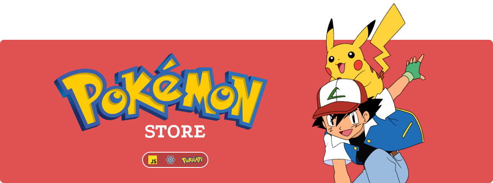

  
  
  </a>

 <h1 align="center">:rotating_light: Projeto em desenvolvimeto :rotating_light:</h1>

## Sobre o PokeStore
O PokeStore é uma aplicação de compras de pokemon desenvolvida para como forma de estudo.
## Tecnologias
 - [JavaScript](https://developer.mozilla.org/pt-BR/docs/Web/JavaScript)
 - [ Nodejs ]( https://nodejs.org/en/ )
 - [React](https://reactjs.org/)
 - [Redux](https://reactjs.org/)
 - [CSS-Grid](https://reactjs.org/)
 - [CSS-flex-box](https://reactjs.org/)
